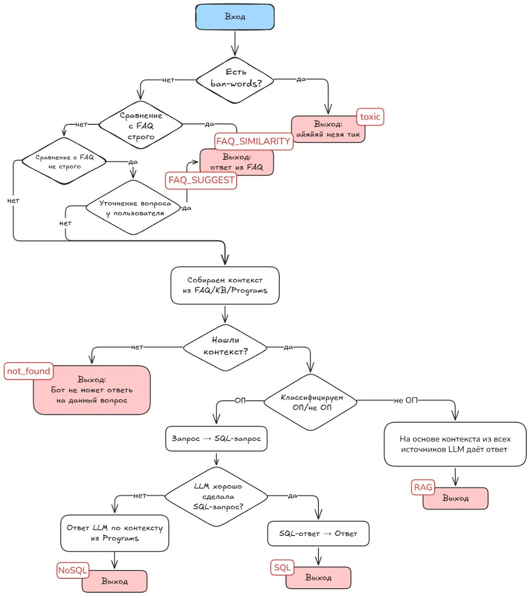
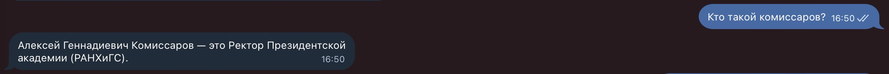
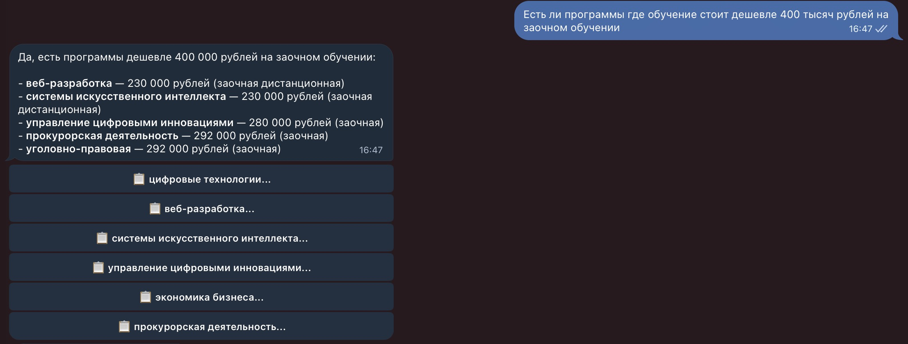
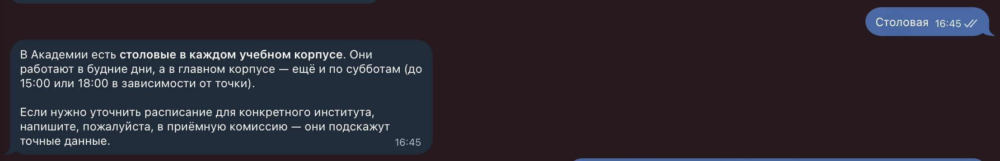

# Ranepa Helper NLP Bot

Интеллектуальный Telegram-бот для абитуриентов РАНХиГС. Бот отвечает на вопросы о поступлении, образовательных программах, стоимости обучения, проходных баллах, бюджетных и платных местах, требованиях к ЕГЭ и документах.

Проект использует гибридный подход: **FAQ retrieval + RAG + SQL search + LLM generation**. Это позволяет отвечать не только на типовые вопросы, но и на запросы по табличным данным образовательных программ.

> Текущая реализация ориентирована на данные Президентской академии, но архитектуру можно адаптировать под другой вуз при замене локальных источников данных.

---

## GitHub About

**Description:**

```text
Hybrid FAQ + RAG + SQL Telegram assistant for university applicants.
```

**Topics:**

```text
rag
llm
telegram-bot
faiss
sentence-transformers
sqlite
nlp
russian-nlp
```

---

## Архитектура

Ниже — реальная схема маршрутизации запросов в проекте. Именно она отражает основную логику работы пайплайна: проверку на токсичность, FAQ-маршруты, сбор контекста, классификацию в SQL / NoSQL / RAG и fallback-ветку `not_found`.



### Основные ветки пайплайна

| Route | Когда используется | Что возвращает |
|---|---|---|
| `toxic` | Вопрос содержит ban-words или токсичный контент | Безопасный отказ |
| `FAQ_SIMILARITY` | Найдено уверенное совпадение с FAQ | Готовый ответ из FAQ |
| `FAQ_SUGGEST` | Найден похожий FAQ-вопрос, но сходство недостаточно высокое | Уточнение у пользователя |
| `not_found` | Контекст не найден ни в FAQ, ни в базе знаний, ни в программах | Сообщение о невозможности ответить по данным |
| `SQL` | Вопрос относится к образовательным программам, и SQL-запрос построен корректно | Структурированный ответ из SQLite |
| `NoSQL` | Вопрос про программы, но SQL-запрос не удалось построить надёжно | Ответ по найденному контексту из Programs |
| `RAG` | Общий вопрос, требующий контекста из базы знаний | Ответ LLM на основе найденного контекста |

Ключевая идея: LLM не используется как единственный источник истины. Она получает ограниченный контекст из локальных данных и отвечает только на его основе.

---

## Примеры работы бота

Ниже размещены **заглушки** для будущих реальных скриншотов из Telegram. Позже их можно просто заменить на ваши настоящие изображения без изменения структуры README.

| FAQ / быстрый ответ | SQL / программы | RAG / общий вопрос |
|---|---|---|
|  |  |  |

**Рекомендуемые реальные скриншоты для замены:**

1. ветка `FAQ_SIMILARITY` — пример вопроса, на который бот отвечает сразу из FAQ;
2. ветка `SQL` — запрос по программе, стоимости, ЕГЭ, местам или проходным баллам;
3. ветка `RAG` — общий вопрос, на который бот отвечает по собранному контексту.

---

## What it does

Бот помогает абитуриенту быстро получить ответы на вопросы вроде:

- какие ЕГЭ нужны для поступления на программу;
- сколько стоит обучение;
- какой проходной балл был в прошлом году;
- сколько бюджетных и платных мест доступно;
- какие документы нужны для поступления;
- чем отличаются программы, мегакластеры и направления;
- какие программы подходят под заданные баллы ЕГЭ.

Дополнительно реализованы:

- фильтрация токсичных сообщений;
- подсказка похожего FAQ-вопроса, если совпадение неидеальное;
- inline-кнопки для просмотра баллов, стоимости, ЕГЭ, мест и полного описания программы;
- fallback-режим без LLM, в котором бот всё равно возвращает найденные данные.

---

## How it works

Система обрабатывает пользовательский вопрос по гибридному пайплайну. Логика соответствует схеме выше: сначала бот пытается дать быстрый и точный ответ через FAQ, затем при необходимости собирает контекст из FAQ, базы знаний и таблицы программ, после чего выбирает SQL-, NoSQL- или RAG-ветку.

### 1. Вход и toxicity filter

Пользователь отправляет вопрос в Telegram-бота. На первом шаге сообщение проверяется на наличие ban-words и токсичного содержания.

- Если токсичность обнаружена, бот возвращает безопасный отказ: `toxic`.
- Если сообщение корректное, оно передаётся в FAQ matching.

### 2. Strict FAQ matching

Бот сравнивает вопрос пользователя с FAQ в строгом режиме.

- Если найдено сильное совпадение, бот сразу возвращает готовый ответ из FAQ: `FAQ_SIMILARITY`.
- Это самый быстрый и надёжный сценарий, потому что не требует генерации ответа через LLM.

### 3. Soft FAQ matching и уточнение

Если строгого совпадения нет, бот выполняет менее строгий поиск похожих FAQ-вопросов.

- Если найден похожий вопрос, бот предлагает пользователю уточнение: `FAQ_SUGGEST`.
- Если пользователь подтверждает, бот возвращает ответ из FAQ.
- Если пользователь не подтверждает или похожий FAQ не найден, запрос уходит дальше в контекстный поиск.

### 4. Сбор контекста

Бот собирает релевантный контекст из трёх источников:

- FAQ;
- базы знаний / регламентов;
- таблицы образовательных программ.

Если контекст не найден, бот возвращает fallback-ответ: `not_found`.

### 5. Классификация запроса: образовательная программа или общий вопрос

Если контекст найден, система классифицирует вопрос:

- **ОП** — вопрос про образовательную программу, стоимость, ЕГЭ, бюджетные места, проходные баллы или форму обучения;
- **не ОП** — общий вопрос про поступление, документы, правила приёма или структуру обучения.

### 6. SQL branch

Если вопрос относится к образовательным программам, бот пытается преобразовать запрос пользователя в SQL-запрос к локальной SQLite-базе.

- Если SQL-запрос построен корректно, бот возвращает структурированный ответ по найденным программам: `SQL`.
- Если SQL-запрос построить не удалось, бот использует найденный контекст из таблицы программ и формирует fallback-ответ без SQL: `NoSQL`.

### 7. RAG branch

Если вопрос не относится к конкретной образовательной программе, бот использует RAG-ветку. LLM получает релевантный контекст из всех доступных источников и формирует финальный ответ на его основе: `RAG`.

---

## Planned evaluation

Количественная оценка качества пока находится в планах. Следующая версия проекта может включать отдельные метрики по ключевым веткам пайплайна.

| Метрика | Что измеряет |
|---|---|
| FAQ top-1 / top-k accuracy | Насколько точно система находит правильный FAQ-ответ |
| FAQ suggestion acceptance rate | Как часто пользователь подтверждает предложенный похожий вопрос |
| SQL success rate | Как часто LLM корректно строит SQL-запрос по вопросам об образовательных программах |
| NoSQL fallback rate | Как часто SQL-ветка уходит в fallback-ответ по контексту |
| RAG answer correctness | Насколько корректны ответы в общей ветке на размеченном наборе вопросов |
| not_found rate | Доля вопросов, для которых система не нашла контекст |
| Toxic query detection rate | Корректность обработки токсичных сообщений |
| Average response latency | Среднее время ответа по веткам FAQ / SQL / RAG |

Для первого eval-набора достаточно собрать 50–100 реальных пользовательских запросов и вручную разметить ожидаемый маршрут (`FAQ_SIMILARITY`, `FAQ_SUGGEST`, `SQL`, `NoSQL`, `RAG`, `not_found`).

---

## Tech stack

- **Python 3.10+**
- **pyTelegramBotAPI** — Telegram Bot API
- **pandas / openpyxl** — загрузка Excel-файлов
- **SQLite** — локальная база данных
- **sentence-transformers** — эмбеддинги для FAQ и базы знаний
- **FAISS** — быстрый nearest-neighbor search
- **OpenAI-compatible API / Mistral** — генерация ответа LLM
- **thefuzz** — нечёткий поиск программ
- **transformers + torch** — токсик-фильтр
- **Natasha** — морфологическая обработка русского языка
- **CrossEncoder** — дополнительный семантический слой в пайплайне

---

## Repository structure

```text
ranepa-helper-nlp-bot/
├── assets/
│   ├── architecture/         # схема обработки запроса
│   └── examples/             # место для будущих реальных Telegram-скриншотов
├── bot.py                    # Telegram-бот, обработчики команд и кнопок
├── config.py                 # конфиг, пути к данным, системные промпты, пороги
├── data_loader.py            # загрузка FAQ, базы знаний, программ и стоп-слов
├── db_manager.py             # создание и работа с SQLite-базой
├── embedding_engine.py       # эмбеддинги и FAISS-индексы
├── llm_client.py             # клиент LLM, SQL generation, formatting, classification
├── pipeline.py               # основной оркестратор пайплайна
├── program_search.py         # поиск программ, подбор по ЕГЭ, форматирование карточек
├── toxicity_filter.py        # rule-based + ML фильтр токсичности
├── requirements.txt          # зависимости проекта
├── .env.example              # пример переменных окружения
└── README.md
```

---

## Data sources

Проект работает на локальных данных в папке `data/`. Данные не включены в публичный репозиторий.

### 1. FAQ

Файл: `data/Database.xlsx`

Ожидаемые колонки:

- `Question` — вопрос абитуриента;
- `Answer` — готовый ответ;
- `Question type` — тип вопроса.

### 2. База знаний

Файл: `data/Database-2.xlsx`

Ожидаемые колонки:

- `Question type` — тип информации;
- `Question` — текст вопроса / темы;
- `Answer` — текстовый фрагмент базы знаний.

### 3. Таблица образовательных программ

Файл: `data/mega_cluster.xlsx`

Используется для:

- SQL-поиска по программам;
- подбора программ по баллам ЕГЭ;
- карточек программ с ценой, местами, экзаменами и проходными баллами.

---

## How to run

### 1. Установить зависимости

```bash
pip install -r requirements.txt
```

### 2. Подготовить `.env`

Создайте файл `.env` на основе `.env.example` и укажите ключи и пути к данным.

### 3. Подготовить локальные данные

Убедитесь, что файлы FAQ, базы знаний, таблицы программ и stop-words находятся по путям, указанным в `config.py`.

### 4. Запустить бота

```bash
python bot.py
```

---

## Limitations

- Публичная версия не содержит реальные данные вуза.
- Качество SQL generation зависит от LLM и формулировки вопроса.
- Оценка качества пока не автоматизирована.
- Архитектура оптимизирована под один домен — поступление в вуз.

## Next steps

- Подставить реальные Telegram-скриншоты вместо текущих заглушек.
- Добавить eval-набор из реальных пользовательских запросов.
- Добавить автоматическую оценку веток FAQ / SQL / RAG.
- Вынести часть логики из отдельных модулей в более формальный сервисный слой.
- Подготовить demo-video работы бота.
